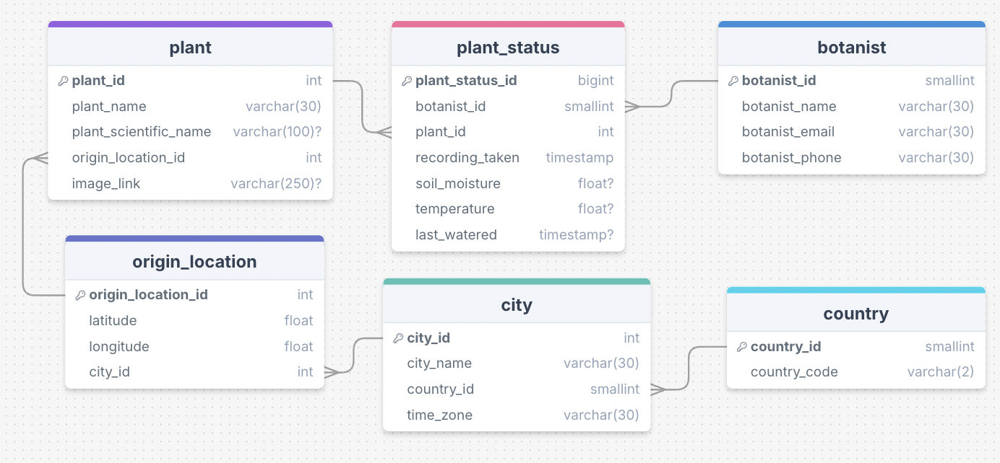

# C15-Cacareco-Project


## Overview
The C15-Cacareco-Project is a full data pipeline system developed for the Liverpool Natural History Museum. It automates the process of collecting, storing, and visualizing plant health data for botanists.

### Key components

1. Pipeline – Extracts, transforms, and loads (ETL) data from an external API.
2. Archive Management – Handles historical data storage.
3. Dashboard – Provides visual insights into plant health metrics.


In this README.md you will find the background setup needed to run this project on your local machine for development and testing purposes. See **deployment** for notes on how to deploy the project on a live system.

## Installation 
### Prerequisites
Ensure you have the following installed

- Docker: [Install docker](https://docs.docker.com/desktop/) based on your machine
- Homebrew: [install instructions](https://brew.sh/)
- Terraform: You can use [brew commands](https://developer.hashicorp.com/terraform/tutorials/aws-get-started/install-cli) to install Terraform

### Python Libraries

This project includes multiple requirements files, all of which are pre-installed in their respective Docker images.

If not using Docker, manually install dependencies, Ensure you have a .venv by running:
```python3 -m venv .venv```
Then running:
```pip3 install -r requirements.txt```.

### Set up

Firstly, You need to set up a .env which has the following information: `DB Host`, `DB Port`, `DB Password`, `DB User`, `DB Name` and a `Schema Name`

In order to build the docker images, either run:
```docker build -t name-tag:latest --platform "linux/amd64" . ```
With a different tag for each of the three images. Or use the relevant shell command using `bash ecr_<relevant_file>-push.sh`

## Architecture
### Data Pipeline
The architecture diagram below outlines the flow of data through the system, from extraction to storage and visualization.

**Data Flow:**

1. **API Data Extraction**:
   - The pipeline starts by extracting plant data from an external API. The API is queried on a scheduled basis, and the data is collected and processed. This ensures that plant health data is always up to date.

2. **ETL Pipeline**:
   - The **ETL (Extract, Transform, Load)** process is handled by an **AWS Lambda function**. The Lambda function is responsible for extracting the data from the API, transforming it into a usable format, and loading it into the database. 
   - The script responsible for this pipeline can be found [here](./pipeline/pipeline.py). The function is containerized using Docker, with the Docker configuration file located [here](./pipeline/Dockerfile). 

3. **Docker and ECR**:
   - The Lambda function is packaged as a Docker image to ensure consistency across environments. We use **Amazon Elastic Container Registry (ECR)** to store the Docker image, which is provisioned and configured using Terraform. The Terraform configuration for this can be found [here](./pipeline/terraform/lambda_pipeline.tf).

**Why Lambda?**
AWS Lambda was chosen for this pipeline due to its scalability, cost-effectiveness, and ability to run event-driven workloads. Lambda allows us to trigger the ETL process in response to specific events (e.g., new data becoming available), without having to maintain a dedicated server. This serverless approach ensures that we only pay for the compute time we use, making it highly cost-efficient.

**Why Docker?**
By using Docker, we can ensure that the Lambda function runs consistently in any environment, from local development to production. Docker images contain all the necessary dependencies, making the Lambda function portable and easy to deploy across different platforms.

**Why Terraform?**
Terraform is used for infrastructure as code (IaC). It allows us to define and provision AWS resources, such as Lambda, ECR, and other services, in a consistent and repeatable manner. With Terraform, we can quickly set up, modify, and tear down the infrastructure as needed, ensuring scalability and maintainability.

---


### Archive
To store historical data a S3 bucket was utilized. The script that archives a snapshot of the database is found here [here](./archive/lambda_function/). We provisioned this bucket using Terraform as found [here](./archive/terraform/main.tf).

**Why S3?**
S3 offers highly durable and cost-effective object storage, making it an ideal choice for archiving structured and semi-structured data.

### Dashboard
We use a Streamlit dashboard which is implemented [here](./dashboard/dashboard.py). The associated ECR [Elastic Container Registry] was provisioned [here](./dashboard/main.tf).

**Why Streamlit?**
Streamlit was chosen for its simplicity and ability to quickly create interactive data visualizations with minimal code.

The dashboard was designed according to this wireframe:


## Testing

Currently there are tests for all written python files. Our tests are written with `pytest`, therefore if you want to run them yourself you should ensure that pytest is installed. 

These were to ensure that CI/CD as that a push request can only be accepted when all tests were passing.

### Seeding

When seeding master data it was imperative that everything went as according to plan, so a test for all the functions were written [here](./schema/test_seed_master_data.py)

### ETL testing
We segmented the tests for the pipeline into [Extract](/pipeline/ETL-scripts/test_extract.py), [Transform](/pipeline/ETL-scripts/test_transform.py), and [Load](/pipeline/ETL-scripts/test_load.py). 

### Archive
To ensure that we achieve the filepath we expect we tested the archive_pipeline function [here](./archive/lambda_function/test_archive_pipeline.py)

To execute these tests, run:
`pytest [filename]`


## ERD [Entity Relationship Diagram]

This ERD defines how plant, botanist, and location data are structured in the database.


## Deployment TODO

Add additional notes about how to deploy this on a live system
